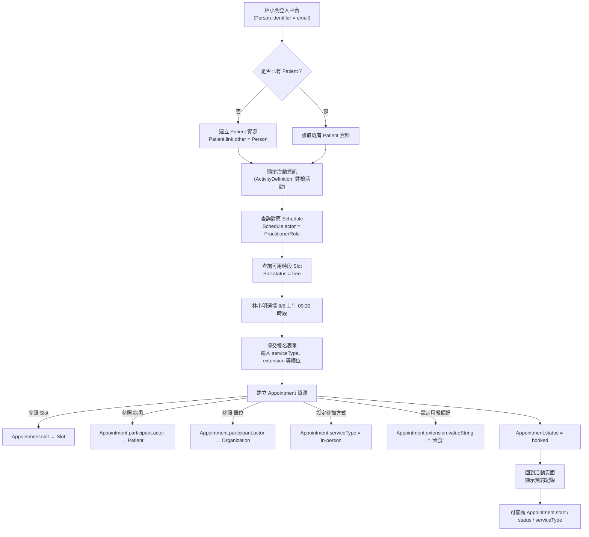

# 🏥 活動報名系統 FHIR 資源設計

## 🎯 系統目的
建置一套符合 FHIR 標準的報名平台，支援病患選擇活動、選擇時段、完成預約，並自動關聯人員與機構資訊，能記錄參加方式與用餐偏好。

---

## 🔧 功能與資源規格表

| 功能           | 說明                                                         | 對應 FHIR 資源與欄位                                                                 |
|----------------|--------------------------------------------------------------|--------------------------------------------------------------------------------------|
| 顯示排班與時段  | 顯示該活動的排班資訊及剩餘可預約時間                             | `Schedule.actor`、`Slot.start`、`Slot.end`、`Slot.status = free`                    |
| 選擇時段並報名  | 使用者選擇一筆 `Slot` 並提交報名表單，系統建立預約                 | `Appointment.status = booked`、`Appointment.slot`、`Appointment.participant` `Appointment.serviceType`（參加方式） `Appointment.extension`（用餐偏好） |
| 報名狀態查詢    | 查詢目前所有活動預約記錄                                         | `Appointment.participant → Patient`、`status`、`start`                              |

---

## 🧾 使用資源一覽

| 資源名稱            | 說明                            | 備註                                             |
|---------------------|----------------------------------|--------------------------------------------------|
| `Schedule`          | 排班資訊                        | 與 `PractitionerRole` 或 `Practitioner` 連結     |
| `Slot`              | 可預約時間區段                  | 每筆 `Slot` 對應 `Schedule` 一段時段             |
| `Appointment`       | 預約紀錄                        | 與 `Slot`、`Patient`、`Organization` 連結         |
| `Patient`           | 病患資料                        | 報名者的醫療身分資料，會連結 `Person`            |
| `Person`            | 使用者帳號與身份                | 儲存 email、姓名等，與 `Patient` 做一對一連結    |
| `Organization`      | 主辦單位、醫療機構              | 例如慈濟醫院，與 `PractitionerRole`、`Appointment` 有關 |
| `Practitioner`      | 醫師或活動人員個體               | 表示一個實際的人，例如林醫師                     |
| `PractitionerRole`  | 人員在某機構中的角色與服務內容   | 將 `Practitioner` 和 `Organization` 連結，供 `Schedule.actor` 使用 |

---

## 📈 活動報名流程圖

___
# Slot 與 Schedule 的關係
| 資源         | 用途       | 關聯方式                              |
| ---------- | -------- | --------------------------------- |
| `Schedule` | 描述某角色的排班 | 透過 `actor` 連結到 `PractitionerRole` |
| `Slot`     | 可預約的實際時段 | `Slot.schedule` 參照一筆 `Schedule`   |

📚 情境範例：林小明報名健檢活動
🧍 使用者背景
姓名：林小明

Email：xiaoming@example.com

尚未有病歷（Patient）紀錄

想報名「2025年度成人健檢」活動

🔁 報名流程情境
林小明登入平台（Person.identifier）

系統發現他沒有 Patient，自動建立並連結

顯示活動資訊：

活動：2025年度成人健檢

單位：Tzu Chi Hospital

時間：2025/08/01 - 2025/08/31

系統查詢活動 Schedule 與對應 Slot

林小明選擇 8/5 上午 09:30 時段

填寫報名表單：

參加方式：實體（Appointment.serviceType = in-person）

用餐偏好：素食（Appointment.extension.valueString = "素食"）

---

